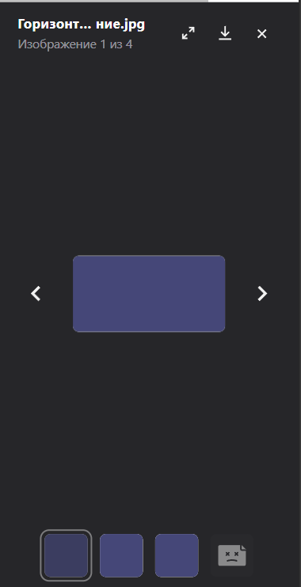
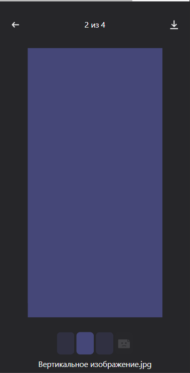

Добавлена поддержка видео: теперь в images можно передавать видео в формате m3u8.

При воспроизведении, паузе, выключения звука и выключения звука трекаются кастомные эвенты. Подписаться на них можно с помощью
```window.addEventListener(GALLERY_EVENTS.ON_PLAY, handler)```
GALLERY_EVENTS экспортируется из `@alfalab/core-components-gallery`

Также изменено отображение в мобильной версии.
Было: 
Стало: 
